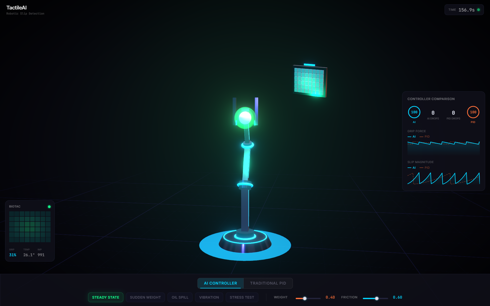

# TactileAI Simulation

> AI-enhanced slip detection and control simulation for robotic grippers using BioTac SP tactile sensors.

This repository provides two complementary simulation environments for exploring and demonstrating slip detection in robotic manipulation:

1. **MATLAB/Simulink Pipeline** — Data-driven classifier training and physics-based control simulation using the BioTac SP Stability Set v2.
2. **Interactive 3D Web Simulation** — A real-time browser-based visualisation built with Three.js, featuring a robotic arm, tactile sensor heatmap, and live telemetry dashboard.

---

## Live Demo

<div align="center">

<a href="https://tactile-ai-simulation.vercel.app">
  
</a>

[](https://tactile-ai-simulation.vercel.app)

</div>

> **Controls:** Orbit with mouse drag · Zoom with scroll · Toggle between **AI Controller** and **Traditional PID** · Trigger scenarios like **Sudden Weight**, **Oil Spill**, or **Stress Test** to compare controller performance.

---

## Repository Structure

```
TactileAI-simulation/
├── nodejs-simulation/           # Interactive 3D web simulation
│   ├── src/
│   │   ├── components/          # React Three Fiber 3D components
│   │   │   ├── Scene.tsx        # Main scene (lighting, post-processing, camera)
│   │   │   ├── RoboticArm.tsx   # Articulated robotic arm with PBR materials
│   │   │   ├── TactileSensor.tsx# BioTac electrode grid visualisation
│   │   │   ├── GraspObject.tsx  # Grasped object with slip response
│   │   │   ├── SlipParticles.tsx# Particle effects on slip detection
│   │   │   └── Dashboard.tsx    # 2D overlay: charts, metrics, pressure grid
│   │   ├── simulation/
│   │   │   └── biotacModel.ts   # Sensor model, slip detection, AI/PID controllers
│   │   ├── App.tsx              # Application root with simulation loop
│   │   └── main.tsx             # Entry point
│   ├── vercel.json              # Vercel deployment configuration
│   └── package.json
│
├── step_1_load_biotac_data.m    # Load and preprocess BioTac dataset
├── step_2_train_biotac_classifier.m  # Train primary slip detector
├── step_3_train_biotac_comparison.m  # Train baseline comparison models
├── step_4_retune_fused_model.m       # Integrate models into control architecture
├── step_5_traditional_vs_ai_simulation.m  # Run comparative simulation
├── build_biotac_simulink.m      # Configure Simulink environment
├── BioTac_SlipDetection_Simplified.slx  # Simulink model
└── biotacsp-stability-set-v2/   # BioTac SP dataset (submodule)
```

---

## Interactive 3D Simulation

A real-time web simulation that visualises how a robotic gripper uses tactile feedback to detect and prevent object slip.

### Features

| Feature | Description |
|---------|-------------|
| **Robotic Arm** | 4-DOF articulated arm with metallic PBR materials and animated gripper fingers |
| **Tactile Sensor** | 6×8 BioTac electrode grid with per-cell pressure-to-colour mapping |
| **Slip Detection** | Real-time slip computation based on grip force, object weight, and surface friction |
| **AI vs PID Control** | Toggle between an adaptive AI controller and a traditional PID controller — both run simultaneously for live comparison |
| **Scenario Presets** | Trigger Steady State, Sudden Weight, Oil Spill, Vibration, or Stress Test to compare controller responses |
| **Object Drop Physics** | Object slides, falls with gravity, and bounces when a controller fails — with red impact flash |
| **Comparison Dashboard** | Overlaid grip force and slip magnitude charts showing AI (solid) vs PID (dashed) in real time |
| **Pressure Heatmap** | 2D BioTac grid showing electrode activation with temperature and impedance readings |
| **Visual Effects** | Bloom, chromatic aberration, vignette, particle effects, and glowing joint rings |

### Tech Stack

- **React Three Fiber** — React renderer for Three.js
- **@react-three/drei** — Scene helpers (OrbitControls, Grid, Float, Environment, ContactShadows)
- **@react-three/postprocessing** — Bloom, chromatic aberration, vignette
- **Tailwind CSS** — Dashboard overlay styling
- **Vite + TypeScript** — Build toolchain

### Running Locally

```bash
cd nodejs-simulation
npm install
npm run dev
```

Opens at [http://localhost:3000](http://localhost:3000).

---

## MATLAB/Simulink Pipeline

A five-step pipeline for training slip detection classifiers and evaluating them against traditional control in a physics-based Simulink simulation.

### Prerequisites

- MATLAB R2022a or later
- Simulink
- Statistics and Machine Learning Toolbox
- Control System Toolbox
- Simulink Control Design

### Pipeline Steps

| Step | Script | Purpose |
|------|--------|---------|
| 1 | `step_1_load_biotac_data.m` | Load and preprocess the BioTac SP Stability Set v2 dataset |
| 2 | `step_2_train_biotac_classifier.m` | Train the primary AI slip detection classifier |
| 3 | `step_3_train_biotac_comparison.m` | *(Optional)* Train baseline models for comparative evaluation |
| 4 | `step_4_retune_fused_model.m` | Integrate trained models into the control architecture and tune parameters |
| 5 | `step_5_traditional_vs_ai_simulation.m` | Run comparative simulation: traditional slip limits vs AI-enhanced controller |

Run `build_biotac_simulink.m` before Step 5 to initialise the Simulink environment.

### Dataset

This project uses the [BioTac SP Stability Set v2](https://github.com/3dperceptionlab/biotacsp-stability-set-v2), included as a Git submodule in `biotacsp-stability-set-v2/`.

---

## Related

- **[TactileAI Dashboard](https://github.com/saadzaincodes/TactileAI-dashboard)** — Industry 5.0 web dashboard for monitoring AI-enhanced BioTac sensors, featuring SHAP explainability, drift detection, and fleet management.
